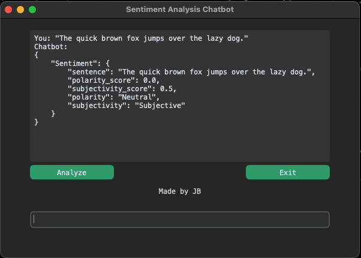

# Natural Language Processing Chat Bot

**Author:** Jakob Balkovec  
**Date:** December 16th, 2023  
**Version:** 2.0  
**License:** MIT License  

## Description

This script implements a sentiment analysis algorithm that determines the sentiment polarity (positive, negative, or neutral) of textual data. The data is displayed in a neat-looking GUI made with the customtkinter module.

## Image


## Usage

Run this script with the necessary dependencies installed and provide the text data to be analyzed. The algorithm will output the sentiment polarity score for each input.

## Requirements

- Python 3.11.2 64-bit env to run the customtkinter module.

## Features

- Sentiment analysis using a custom GUI.
- User-friendly interface with an entry field and chat history display.
- Dark appearance mode with a green color theme.

## Installation

1. Clone the repository:

   ```bash
   git clone https://github.com/your-username/your-repository.git
   cd your-repository
   ```
2. Install the required dependencies:

  ```bash
  pip install -r path/to/requirements.txt
  ```
3. Run the Sentiment Analysis ChatBot:

  ```bash
  python3 chatbotv_2.py
  ```

## Additional Information

- The GUI is built using the customtkinter module.
- The sentiment analysis results are displayed in the chat history.
- User input and chatbot responses are logged in response_log.json.

## License
This project is licensed under the MIT License - see the [Projects/LICENSE] file for details.
